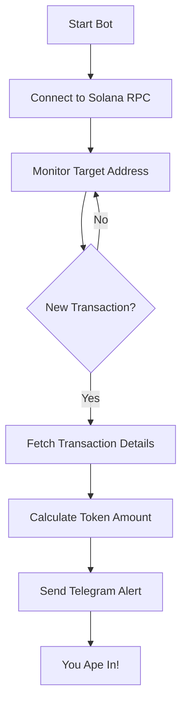

# 🚀 Crypto Moon Alert Bot 🌕

Stay ahead of the pack and catch every big move! This bot monitors transactions on the Solana blockchain and sends you instant alerts on Telegram when someone makes a significant purchase of your favorite token. Don't miss out when your coin is about to go parabolic!

## 🌟 Features

- **Real-time Monitoring**: Keeps an eye on a specific Solana address for incoming transactions.
- **Instant Telegram Alerts**: Get notified the moment a significant transaction happens.
- **Easy Setup**: Configure your target address and token details with simple environment variables.
- **Degen-Friendly**: Designed for those who live and breathe crypto!

## 📈 How It Works



## 🚀 Getting Started

### 🛠 Prerequisites

- Python 3.7 or higher
- Telegram Bot API token (get one from [BotFather](https://t.me/BotFather))
- Telegram Chat ID (where you want to receive alerts)
- Solana RPC endpoint (optional, defaults to mainnet-beta)

### 📥 Installation

1. **Clone the Repository**

   ```bash
   git clone https://github.com/yourusername/crypto-moon-alert-bot.git
   cd crypto-moon-alert-bot
   ```

2. **Install Dependencies**

   ```bash
   pip install -r requirements.txt
   ```

3. **Set Up Environment Variables**

   Create a `.env` file in the root directory:

   ```dotenv
   # Telegram Bot Token
   TELEGRAM_TOKEN=your_telegram_bot_api_token

   # Telegram Chat ID
   CHAT_ID=your_telegram_chat_id

   # Solana RPC URL (optional)
   SOLANA_RPC_URL=https://api.mainnet-beta.solana.com

   # Target Address to Monitor
   TARGET_ADDRESS=YourTargetSolanaAddress

   # Price per Token in USD (optional)
   PRICE_PER_TOKEN_USD=0.01
   ```

### ▶️ Running the Bot

```bash
python bot.py
```

## 🔧 Customization

- **TARGET_ADDRESS**: Set this to the Solana address you want to monitor.
- **PRICE_PER_TOKEN_USD**: Update this to reflect the current price of your token.
- **ALERT THRESHOLD**: Modify the script to set a minimum purchase amount for alerts.

## 🤝 Contributing

Got ideas to make this even better? Feel free to fork the repo and submit a pull request. Let's help every degen out there catch the next moonshot!

## 📄 License

This project is licensed under the MIT License.

## 📞 Support

If you have any questions or need help, open an issue, and we'll get back to you ASAP!

---

*Disclaimer: This bot is for informational purposes only. Always do your own research before making any investment decisions. We are not responsible for any financial losses incurred.*