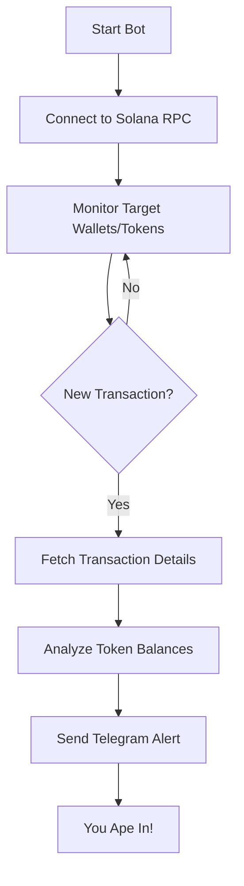

# 🚀 Telegram Crypto Alerts Toolbox 🌕
    
Stay ahead of the pack and catch every big move! This toolbox contains scripts that monitor transactions on the Solana blockchain and send you instant alerts on Telegram when significant activities occur. Don't miss out when your coin is about to go parabolic!

## 🌟 Features

- **Real-time Monitoring**: Keeps an eye on specific Solana addresses and tokens for incoming transactions.
- **Instant Telegram Alerts**: Get notified the moment a significant transaction happens.
- **Easy Setup**: Configure your target addresses and token details with simple environment variables.
- **Degen-Friendly**: Designed for those who live and breathe crypto!

## 📁 Scripts Included

- `walletTradeAlert.py`: Monitors specific wallets for token purchases or sales and sends detailed alerts to Telegram.
- `tokenTelegramActionBot.py`: Monitors general activity of a specific token contract address to alert on heavy sudden activity.

## 📈 How It Works



## 🚀 Getting Started

### 🛠 Prerequisites

- Python 3.7 or higher
- Telegram Bot API token (get one from [BotFather](https://t.me/BotFather))
- Telegram Chat ID (where you want to receive alerts)
- Solana RPC endpoint (optional, defaults to mainnet-beta)

### 📥 Installation

1. **Clone the Repository**

   ```bash
   git clone https://github.com/prestonzen/telegram-crypto-alerts-toolbox.git
   cd telegram-crypto-alerts-toolbox
   ```

2. **Install Dependencies**

   ```bash
   pip install -r requirements.txt
   ```

3. **Set Up Environment Variables**

   Create a `.env` file in the root directory:

   ```dotenv
   # Telegram Bot Token
   TELEGRAM_TOKEN=your_telegram_bot_api_token

   # Telegram Chat ID
   CHAT_ID=your_telegram_chat_id

   # Solana RPC URL (optional)
   SOLANA_RPC_URL=https://api.mainnet-beta.solana.com

   # Watched crypto wallets
   ## Example Wallet
   Watch_Wallet_1=WALLET_ADDRESS
   Watch_Wallet_1_Nickname="NICKNAME"

   # Token to Monitor
   TARGET_ADDRESS=TOKEN_CONTRACT_ADDRESS
   PRICE_PER_TOKEN_USD=1  # Optional, default is 1
   ```

   **Sample `.env` File:**

   ```dotenv
   # Telegram Bot Token
   TELEGRAM_TOKEN=your_telegram_bot_api_token

   # Telegram Chat ID
   CHAT_ID=your_telegram_chat_id

   # Solana RPC URL (optional, default is mainnet-beta)
   SOLANA_RPC_URL=https://api.mainnet-beta.solana.com

   # Watched crypto wallets
   ## Tate's Wallet
   Watch_Wallet_1=4jRX4iW2F5wBnfYMyB7RjS2PU5MjXrST3fB9DoV4BjHa
   Watch_Wallet_1_Nickname="Tate's Wallet"

   # Token to Monitor
   TARGET_ADDRESS=CRYPTO_CONTRACT_ADDRESS
   PRICE_PER_TOKEN_USD=1  # Optional, default is 1
   ```

### ▶️ Running the Bots

#### **1. walletTradeAlert.py**

Monitors specific wallets for token transactions.

```bash
python walletTradeAlert.py
```

#### **2. tokenTelegramActionBot.py**

Monitors general activity of a specific token contract address for heavy sudden activity.

```bash
python tokenTelegramActionBot.py
```

## 🔧 Customization

### **Monitoring Multiple Wallets**

You can monitor multiple wallets by adding more entries in your `.env` file:

```dotenv
# Watched crypto wallets
## Wallet 1
Watch_Wallet_1=WALLET_ADDRESS_1
Watch_Wallet_1_Nickname="NICKNAME_1"

## Wallet 2
Watch_Wallet_2=WALLET_ADDRESS_2
Watch_Wallet_2_Nickname="NICKNAME_2"
```

### **Monitoring a Specific Token**

In `tokenTelegramActionBot.py`, you can monitor a specific token contract address:

```dotenv
# Token to Monitor
TARGET_ADDRESS=TOKEN_CONTRACT_ADDRESS
PRICE_PER_TOKEN_USD=0.01  # Update this to reflect the current price of your token
```

### **Adjust Alert Details**

Modify the scripts to change how alerts are formatted or to include additional transaction details.

- **Alert Thresholds**: Set minimum transaction amounts to filter out small trades.
- **Formatting**: Customize the message format to suit your preferences.

### **Use a Custom Solana RPC Endpoint**

For better performance or higher rate limits, consider using a custom Solana RPC provider. Update the `SOLANA_RPC_URL` in your `.env` file accordingly.

## 📝 Script Details

### `walletTradeAlert.py`

This script monitors specified wallets for token transactions and sends alerts to a Telegram chat. Alerts include:

- **Action**: Whether the wallet bought or sold tokens.
- **Amount**: The number of tokens transacted.
- **Token Name**: Retrieved from the Solana token list.
- **Token Address**: The contract address of the token.
- **Transaction Time**: Timestamp in UTC.
- **Dexscreener Link**: Direct link to view the token on Dexscreener.

#### Message Format Example

```
🔥🚀 Tate's Wallet Tracker Bot Alert! 🚀🔥

Tate's Wallet bought 6.2852 of SOL with the contract address of:
📝 2sdEPSaeJSufxqJdNfG3f9RSFhT63Muysm5ymbdxpump 📝
At 2024-11-21 06:45:34 UTC 🕒

🔗 View on Dexscreener
💰💎📈
```

### `tokenTelegramActionBot.py`

This script monitors general activity of a specific token contract address to alert on heavy sudden activity. Alerts include:

- **Transaction Type**: Purchase or sale.
- **Amount**: Number of tokens transacted.
- **Total Value**: Estimated USD value based on `PRICE_PER_TOKEN_USD`.
- **Transaction Time**: Timestamp in UTC.
- **Transaction Signature**: Unique identifier for the transaction.
- **Explorer Links**: Direct links to view the transaction on Solana Explorer and the token on Dexscreener.

#### Message Format Example

```
🚨 Token Activity Alert! 🚨

Large transaction detected for TOKEN_SYMBOL:

Action: Bought
Amount: 500,000 TOKEN_SYMBOL
Estimated Value: $5,000 USD
At: 2024-11-21 06:45:34 UTC 🕒

🔗 [View Transaction](https://explorer.solana.com/tx/TRANSACTION_SIGNATURE)
🔗 [View Token on Dexscreener](https://dexscreener.com/solana/TOKEN_MINT_ADDRESS)

📊 Stay informed on sudden market moves!
```

## 🤝 Contributing

Got ideas to make this even better? Feel free to fork the repo and submit a pull request. Let's help every degen out there catch the next moonshot!

## 📄 License

This project is licensed under the MIT License.

## 📞 Support

If you have any questions or need help, open an issue, and we'll get back to you ASAP!

---

*Disclaimer: This bot is for informational purposes only. Always do your own research before making any investment decisions. We are not responsible for any financial losses incurred.*

---

## ⚙️ Full Configuration Example

Below is a full example of the `.env` file and how to configure it for monitoring specific wallets and a token contract address.

### `.env` File

```dotenv
# Telegram Bot Token
TELEGRAM_TOKEN=your_telegram_bot_api_token

# Telegram Chat ID
CHAT_ID=your_telegram_chat_id

# Solana RPC URL (optional, default is mainnet-beta)
SOLANA_RPC_URL=https://api.mainnet-beta.solana.com

# Watched crypto wallets
## Tate's Wallet
Watch_Wallet_1=4jRX4iW2F5wBnfYMyB7RjS2PU5MjXrST3fB9DoV4BjHa
Watch_Wallet_1_Nickname="Tate's Wallet"

## Another Wallet
Watch_Wallet_2=WALLET_ADDRESS_2
Watch_Wallet_2_Nickname="Another Wallet"

# Token to Monitor
TARGET_ADDRESS=CRYPTO_CONTRACT_ADDRESS
PRICE_PER_TOKEN_USD=1  # Update to the current price per token
```

### Notes:

- Replace `your_telegram_bot_api_token` with your actual Telegram bot API token.
- Replace `your_telegram_chat_id` with your Telegram chat ID where you want to receive alerts.
- The `SOLANA_RPC_URL` can be left as is or replaced with a custom endpoint if you have one.
- For the token monitoring script (`tokenTelegramActionBot.py`), ensure `TARGET_ADDRESS` is set to the token's contract address.

## 🐳 Docker Support

For those who prefer using Docker:

1. **Build the Docker Image**

   ```bash
   docker build -t telegram-crypto-alerts-toolbox .
   ```

2. **Run the Docker Container**

   ```bash
   docker run -d --env-file .env telegram-crypto-alerts-toolbox
   ```

Make sure your `.env` file is in the same directory and properly configured.

## 🛡 Security Considerations

- **Protect Your `.env` File**: Never share your `.env` file or commit it to a public repository. It contains sensitive information.
- **API Tokens**: Keep your Telegram bot token secure to prevent unauthorized access.
- **Rate Limits**: Be mindful of the Solana RPC rate limits. Use a dedicated RPC provider if necessary.

## 🔄 Updating the Token List

The scripts fetch the Solana token list to map token mint addresses to their symbols. The list is cached in memory for efficiency.

- **Refreshing the Token List**: If you need to refresh the token list (e.g., to include new tokens), you can restart the scripts.
- **Custom Token Names**: If a token isn't listed, the scripts will use the mint address as the token name.

## 📢 Disclaimer

This bot is a tool to assist in monitoring blockchain transactions. Cryptocurrency investments carry risk, and past performance is not indicative of future results. Always exercise caution and do your own due diligence.

---

Enjoy your crypto journey, and may the gains be ever in your favor! 🚀🌕